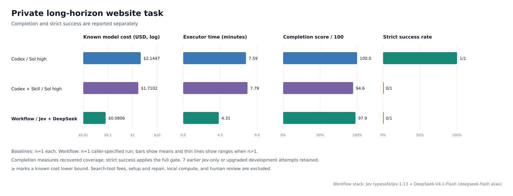
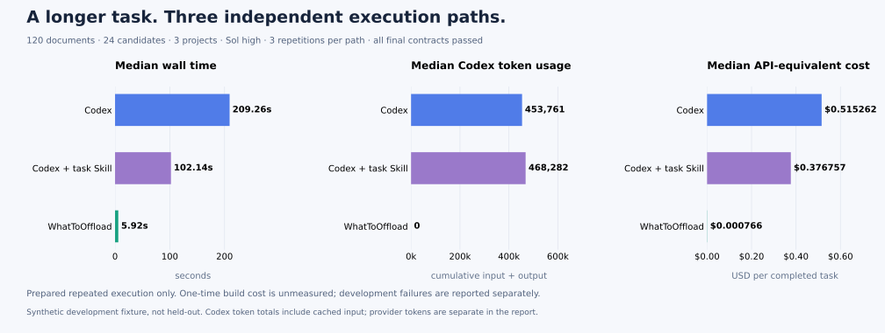

# WhatToOffload

[English](README.md)

> **状态：Experimental（实验阶段）。** 工作流、模板和评估方法仍在演进；用于生产环境前，请自行验证输出。

**把 Agent 反复执行的工作，变成可测试的软件工作流。**

WhatToOffload 是一个 Agent Skill。它分析已有任务、会话、SOP 或代码库，找出哪些工作可以从 Agent 的持续推理中移出，交给确定性代码、现有工具、[Jev](https://docs.typesafe.ai/llms.txt) 或 LLM 服务，并明确哪些工作仍应由 Agent 或人工处理。

Skill 可以让 Agent 的执行更稳定，却不一定能降低重复执行的消耗：Agent 可能仍需在每次运行中重新读取上下文、决定下一步、调用工具并检查结果。WhatToOffload 要找的，就是可以脱离 Agent 独立执行的自动化边界。

[快速开始](#快速开始) · [工作方式](#工作方式) · [案例](#案例供应商审查) · [实测](#实测) · [项目边界](#项目边界)

## 什么时候适合使用

以下情况适合使用 WhatToOffload：

- Agent 反复执行同一套多步骤流程，并在调度上消耗大量时间或 Token；
- 某个“提示词 + 解析”步骤可以收窄为带类型的明确判断；
- 明确规则、计算、API 调用或校验仍在通过 Agent 推理完成；
- 工作流需要等待审批、回调、定时器或重试，又不应让 Agent 持续轮询；
- 希望基于证据比较脚本、Jev、LLM 服务、Agent 和人工审核的适用边界。

如果任务只执行一次，而且目标仍在探索中，它的价值通常较低。它也不是工作流托管平台：它帮助设计和接入 runner，但本身不提供调度、持久化、部署或密钥管理。

## 快速开始

### 1. 安装 Skill

在 Codex 中，让内置的 Skill installer 把仓库根目录安装为 `what-to-offload`：

```text
使用 $skill-installer 安装下面仓库根目录中的 Skill，
并将它命名为 what-to-offload：
https://github.com/HysenX-LI/WhatToOffload
```

Codex 通常会自动发现新安装的 Skill；如果没有出现，请重启 Codex。安装前如需先审阅项目，请从 [SKILL.md](SKILL.md) 开始。

当前仓库以独立 Skill 的形式提供；上面的安装方式适合本地使用和评估，不代表已经通过插件市场分发。

### 2. 分析一个工作流

向 Agent 提供相关会话、任务说明、代码库、SOP 或执行记录：

```text
使用 $what-to-offload 分析这个任务。
找出最多三个可以交给脚本、Jev 或 LLM 服务的步骤，
以及仍应由 Agent 或人工处理的步骤。
对每项替换说明收益、能力损失、失败检测和验证方法。
先给方案，不修改代码。
```

### 3. 先设计，再实施

选定候选方案后，要求展开设计：

```text
展开第一个方案。给出完整工作流、每一步的输入和输出、
异常处理、交回条件和验收测试。
```

设计确认后，再明确授权实施：

```text
使用项目现有技术栈实施这个方案。
先验证结果质量，再比较成本和耗时；同时记录哪些情况
仍需交回 Agent 或人工审核。
```

当前任务中对真实 API 或付费模型调用的精确授权，可在服务、数据、费用、目标、副作用和范围不变时继续复用；其中任一项发生实质变化时才重新确认。部署和外部副作用仍必须保持在对应的精确授权边界内。

## 会得到什么

WhatToOffload 把分析、设计和实施分开，避免一个优化建议未经确认就变成代码修改。

| 模式 | 产出 | 是否修改代码 |
| --- | --- | --- |
| **分析** | 最多三个优先候选，以及前提、收益、能力损失、风险和验证方案 | 否 |
| **设计** | 逐节点工作流、执行方式、输入输出契约、恢复路径、交回条件和验收测试 | 否 |
| **实施** | 使用现有技术栈实现并测试 runner 或项目集成 | 是，仅在明确要求时 |

候选流程可以是一次调用内完成的**短时流程**，也可以是需要跨重启保存状态，或等待事件、定时器、重试、审核和审批的**持久异步流程**。

## 工作方式

Skill 会为每个原子步骤同时记录“能力角色”和“具体实现”：

| 任务中的工作 | 可能的执行者 | 关键问题 |
| --- | --- | --- |
| 读取文件、调用已知 API、计算、去重、校验和保存 | 确定性代码或现有工具 | 规则是否明确，能否发现不支持的输入？ |
| 判断描述属于哪一类、候选是否符合条件 | Jev | 问题是否足够具体且有类型约束，候选与上下文是否完整？ |
| 解释复杂材料或生成说明 | LLM 服务 | 是否提供必要证据，结果能否校验，调用是否有预算？ |
| 目标变化后重新规划，或与用户协商 | 当前 Agent 或人工 | 是否仍需要开放探索或承担责任？ |

最终方案并不强制采用“代码 → Jev → LLM”的固定流水线。每一步都交给能够满足质量、安全和可测试要求的最简单执行者。确定性控制流和副作用由代码负责；不确定或不支持的情况进入明确的恢复与交回路径。

面对大范围信息查询时，来源发现、来源类型优先级、规范化、去重、检索顺序和明确预算由代码与检索工具负责。确定性筛选之后，只把证据充分、范围明确且会改变后续动作的语义歧义交给 Jev；WhatToOffload 不再建议把每个候选或页面扩展判断都交给 Jev。广泛使用 Jev 路由仍属于实验方案，只有在独立冻结的迁移案例中同时改善完整任务质量与成本后才能采用。检索预算耗尽意味着结果仍未解决，不能被写成已验证的“没有找到”。

对于多阶段或使用模型的工作流，WhatToOffload 还会设计审计边界。可移植的 JSONL 日志记录候选覆盖、语义判断、阈值、原因码、预算、证据链、异常路由，以及字段从接受到最终输出的交接。原始来源和完整模型请求响应放在另一个经过许可的本地追踪目录中，审计日志只通过不透明引用和哈希关联。评分后，确定性的缺漏归因会定位最早的致因阶段：发现、检索、解析、规范化、上下文封装、判断、异常处理、证据替换、交接、组装或评分。下一轮应修改真正负责的边界，而不是根据最终分数猜测。[查看工作流可观测性与缺漏归因方法](references/workflow-observability.md)。

审计事件、冻结字段参考和缺漏报告在 `assets/schemas/` 下提供严格 JSON Schema。`scripts/validate_audit_log.py` 仅用 Python 标准库检查跨事件血缘和隐私不变量；`scripts/generate_gap_attribution.py` 生成确定性的字段级归因，并在轨迹不足以支持原因时返回 `trace_incomplete`。`assets/templates/` 下的文件仍是示例或设计辅助材料，不是正式 Schema。

评估方法分为七步：

1. 观察当前行为及其依赖的上下文。
2. 在选择替换方案前定义验收要求。
3. 比较执行方式及各自可能损失的能力。
4. 明确证据和输入契约。
5. 限定重试、不确定性和交回行为。
6. 用相同案例对比替换前后的表现。
7. 衡量完整任务的质量、成本、耗时和剩余 Agent 工作量。

[查看完整的执行方式选择方法](references/executor-selection.md#work-through-a-replacement)。

## 案例：供应商审查

假设 Agent 每周都要审查供应商报价：读取文件、计算总额、解释条款、筛选候选并撰写说明。

| 步骤 | 卸载后的执行方式 |
| --- | --- |
| 读取报价与修订版本 | 代码解析已知格式、检查必需材料并发现不支持的输入 |
| 计算总额并应用明确约束 | 代码执行可复现的计算和规则校验 |
| 判断报价条款是否符合给定要求 | Jev 基于原始证据完成范围明确的判断 |
| 解决例外或有歧义的材料 | 只在明确的异常分支调用 LLM 服务 |
| 改变目标、批准采购或处理证据缺失 | 工作流交回 Agent 或人工 |

设计还必须说明如何发现解析失败、候选不完整、判断不确定和服务商错误。更快、更便宜但遗漏了不支持的结果，并不算成功优化。

公开案例包括：[测试失败分析](examples/code-triage.md)、[网页调研](examples/web-research.md)、[候选对象初筛](examples/business-screening.md)和[跨多日的供应商审查](examples/durable-vendor-review.md)。

## 实测

### 网站信息处理长程任务

我们在同一个私有任务上比较了三种执行方式。两个 Codex 方案使用 Sol high；WhatToOffload 设计的工作流使用 Jev（`typesafe/jev-1.13`），并只在明确的异常分支使用 DeepSeek-V4.1-Flash。

| 方案 | 模型执行费用 | 耗时 | 完成度 / 100 |
| --- | ---: | ---: | ---: |
| Codex 直接执行 | $4.5361 | 13.14 分钟 | 92.8 |
| Codex + 任务 Skill | $3.5562 | 12.72 分钟 | 96.4 |
| WhatToOffload 设计的工作流 | $0.0472 | 3.40 分钟 | 83.2 |



这次运行中，工作流更便宜、更快，但完成度低于两组基线。每种方案只运行了一次，而且**三组均未通过严格验收**。这组结果只能说明一个具体设计中的权衡，不能代表普遍成功率。费用只包含模型执行，不包含构建、调试和其他准备成本。[查看完整报告与测量边界](benchmarks/results/website-long-horizon.md)。

### 合成批处理任务

另一组研究包含 120 份材料、24 个候选对象和 3 个项目，覆盖报价修订、证据冲突、计算、排序和报告。三种方案各运行三次。



这里测量的是程序准备完成后的重复执行消耗，一次性构建成本未完整计量。任务也参与了程序开发，因此它是开发案例，不能证明对未见案例的泛化能力。[完整结果](benchmarks/results/long-task.md) · [测量方法](benchmarks/README.md)

## 项目边界

- WhatToOffload 是设计与实施 Skill，不是调度器、Worker 托管服务、数据库、队列、部署平台、运维控制台或密钥管理器。
- 卸载是把必要推理放到合适的执行者中，并不等于消除全部模型推理。
- Jev 无法选出候选中不存在的答案，脚本可能遗漏陌生格式，LLM 异常处理也有成本和失败方式。
- 质量和证据属于验收要求；只有先满足结果质量，才比较成本和耗时。
- 外部操作和真实 API 调用必须保持在用户授权范围内。

## 仓库导航

| 路径 | 内容 |
| --- | --- |
| [SKILL.md](SKILL.md) | Agent 指令与工作模式 |
| [LICENSE](LICENSE) | MIT 许可证 |
| [`references/`](references/) | 执行方式选择、工作流可观测性、流程分类、安全、不确定性和测试驱动实施 |
| [`assets/templates/`](assets/templates/) | 分析/设计交接，以及审计、缺漏、结果信封和持久状态快照示例 |
| [`assets/schemas/`](assets/schemas/) | 审计事件、冻结字段参考和缺漏归因的正式 JSON Schema |
| [`scripts/`](scripts/) | 基于标准库的审计校验器与确定性字段级缺漏归因工具 |
| [`examples/`](examples/) | 短时与持久工作流的完整案例 |
| [`benchmarks/`](benchmarks/) | Benchmark 方法、Fixture、测试、报告和公开汇总结果 |

实施 Jev 节点时，优先使用可用的 `typesafe-ai` Skill，并查阅 [TypeSafe 官方文档](https://docs.typesafe.ai/llms.txt)。

## 许可证

WhatToOffload 使用 [MIT License](LICENSE) 发布。
