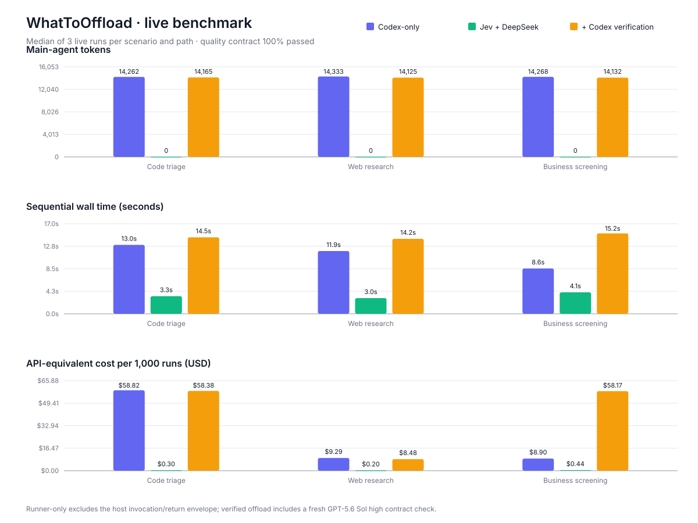

# WhatToOffload

[English](README.md)

WhatToOffload 是一个用于改造现有会话、代码项目、SOP 和工作流的 Agent Skill。它帮助用户重新划分当前 Agent 与普通软件之间的职责边界。

它先识别原子节点，再把相关节点组合成短时有界或持久异步的可卸载子流程，并为每个节点选择能够可靠完成任务的最简单执行者：确定性代码、现有工具或 API、Jev、小模型、强模型或外部 Agent，以及人工复核。

## 它能做什么

- 先检查 Agent 已经能访问的材料，再询问真正缺失的关键信息。
- 默认给出少量、有推荐顺序的卸载候选，同时说明哪些节点应该继续保留在当前 Agent 中。
- 分开判断“节点在哪里运行”和“节点由什么能力完成”。
- 用户选中候选后，展开流程图、节点表、接口、失败路径、审批点和测试方案。
- 识别流程是否必须跨进程存活，或等待定时器、外部事件、延迟重试、输入、复核和审批，并设计持久状态与恢复边界。
- 使用契约驱动的 TDD：先定义可观察行为，确认测试因目标能力尚未实现而失败，再完成最小实现并保留回归保护。
- 获得明确实施授权后，保留目标项目现有技术栈，并在合适时生成可导入函数和 JSON CLI。
- 使用统一状态区分完成、缺少输入、需要语义复核、需要审批和失败。

## 它不是什么

WhatToOffload 不是工作流运行平台。第二阶段可以设计并接入一个现有或经过明确选择的持久运行时，但这个 Skill 本身不提供调度、worker、持久化、部署、队列、控制台或密钥管理。

## 典型使用方式

1. 让 WhatToOffload 分析一个现有工作流。
2. 查看最多三个优先候选、它们属于短时还是持久异步流程，以及建议继续留给 Agent 的节点。
3. 选中一个候选，获得与具体绘图工具解耦的详细工作流设计。
4. 如果希望修改目标项目，再明确授权实施。

真实的付费 API 调用和外部副作用发生前，Skill 会单独停下来获取确认。

## 两种工作流模式

- **第一阶段——短时有界：** 在一次调用中完成，或者返回由即时调用方管理的交接状态。
- **第二阶段——持久异步：** 跨进程存活，并从外部运行时持久化的事件、定时器、重试或人工动作中恢复。

第二阶段会把活动执行结果与工作流生命周期分开。活动使用 `completed`、`needs_input`、`needs_review`、`needs_approval` 或 `failed`；持久快照使用 `active`、`waiting`、`completed`、`failed` 或 `cancelled`，等待原因单独记录。

## 案例

- [测试失败与问题分诊](examples/code-triage.md)
- [网页调研与证据综合](examples/web-research.md)
- [商业入口与候选对象初筛](examples/business-screening.md)
- [持久化的多日供应商审查](examples/durable-vendor-review.md)

每个案例刻意保持小体量：提供端到端规格和关键代码形态，但不维护单独的完整示例应用。

## Jev 与 TypeSafe

WhatToOffload 负责识别哪些节点适合使用有界、带类型的语义判断。进入 Jev 实施前，Agent 必须读取当前环境中的 `typesafe-ai` Skill，并查阅最新的 [TypeSafe 官方文档](https://docs.typesafe.ai/llms.txt)。控制流、确定性规则、副作用和不确定性路由仍由代码负责。

## 真实调用基准

仓库包含一个可复现、默认关闭的三案例对比。每条实测路径都运行 3 次，真实调用 GPT-5.6 Sol high、OpenRouter 上的 Jev 1.13 和 DeepSeek Flash。

在这组合成数据中，真正的 Jev + DeepSeek runner-only 路径在全部通过案例契约的同时，将串行中位耗时降低了 52.5–75.0%，将 API 等价成本降低了 95.0–99.5%。但如果每次卸载结果都再启动一次全新的 Sol high 复核，优势会被大幅抵消。这说明日常、已验证的正常结果应留在强 Agent 循环之外，只让低置信度或异常状态重新进入复核。

可阅读[方法与限制](benchmarks/README.md)，或查看[完整结果表](benchmarks/results/latest.md)。真实调用保持显式 opt-in，执行前仍需授权。

## 项目结构

- `SKILL.md` 是唯一 Skill 入口。
- `references/` 保存按需读取的短时流程、持久异步流程、执行者选择、安全方法与测试驱动实施指南。
- `assets/templates/` 保存人类可审阅的规格模板和 JSON 协议示例。
- `examples/` 保存覆盖两种工作流模式的精简跨领域案例。
- `agents/openai.yaml` 提供可选的 Codex 展示元数据，不污染通用 Skill 指令。
- `benchmarks/` 保存离线契约测试、合成样例、显式启用的真实调用脚本与脱敏结果。

## 第二阶段边界

持久异步模块覆盖状态归属与版本、事件、定时器、重试、幂等、人工等待、恢复、取消、可观测性和运行时适配。它优先使用目标项目已经在运维的基础设施；如果当前没有持久运行时，运行时选择会作为明确的架构决策停点，而不是静默生成一个自制调度器。

后续仍可增加更多专业 Skill 路由、更好的可视化和经过验证的持久化案例，但不会把本仓库变成运行平台。

## 当前状态

当前仓库只包含 Skill 源文件。它不会自动安装，也不会配置或运行工作流基础设施。外部 API 探测默认关闭，只有获得明确授权后才会执行。

在 2026-09-20 的开发验证中，一次获得明确授权的合成数据契约测试成功验证了 OpenRouter Decisions API 的 Choice、Noul、Score 返回，以及 DeepSeek OpenAI 兼容 Chat Completions 的严格 JSON 生成。仓库中不包含任何密钥或供应商专用运行配置；该结果只证明当次兼容性，不构成永久可用性保证。
