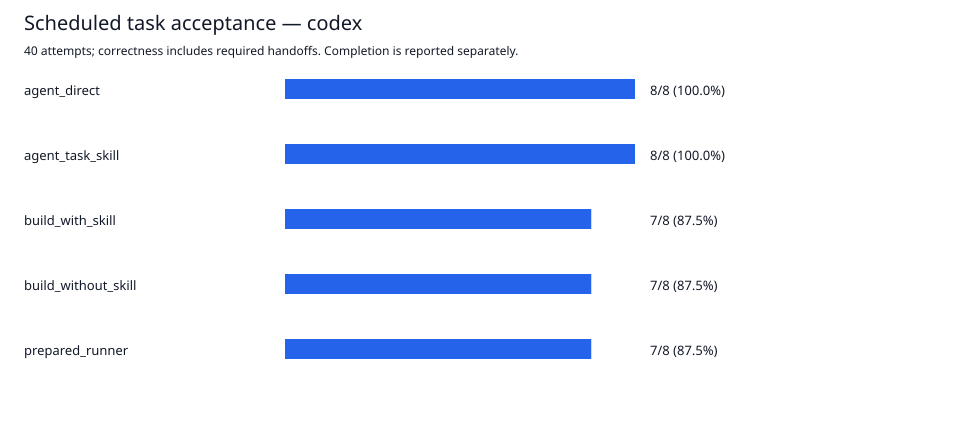

# Codex v2 evidence

Formal run `codex-v2-formal-1` is complete: **40 / 40 scheduled attempts executed**, **37 accepted**, 42 Codex process calls and 73 CLI-reported tool items. No provider/process failures or reconnects occurred in the formal run.

All calls used ChatGPT-authenticated Codex, GPT-5.6 Sol / high. Independent billed API calls: none. Account billing cost: **unknown**, not zero. No credits were bought or reset credits consumed.

[Generated full report](results/formal-1/report.md) · [all records and metrics](results/formal-1/report.json) · [event audit](results/formal-1/calls/event-audit.json) · [frozen protocol](PROTOCOL.md)

## A — prepared execution

| Arm | Accepted cases | Review rows | Correct business completion | Median seconds | Input / cached / output tokens | Codex calls |
|---|---|---|---|---:|---|---:|
| Codex direct | 8/8 | 3/12 | 2/8 | 30.549 | 268,541 / 198,016 / 7,158 | 8 |
| Codex + task Skill | 8/8 | 3/12 | 2/8 | 40.341 | 345,302 / 279,552 / 9,692 | 8 |
| Prepared code + bounded Codex | 7/8 | 4/12 | 2/8 | 8.859 | 69,393 / 46,592 / 186 | 8 |

The prepared runner used 74.2% fewer reported input tokens and had 71.0% lower median execution latency than direct Codex **in this run**, with lower frozen-contract acceptance. This is a measured execution tradeoff, not equal-quality savings or a net lifetime/billing-cost result. Startup, context transfer, tools and return are included; grading and one-time preparation are excluded.

Cached tokens are included in input, not added on top. All arms had zero wrong automatic releases (0/6 predicted eligible), 46/46 valid citations and 0/12 omitted rows. Correct review recall was 3/3. The runner added one review row and missed the required approval handoff; its 7/8 acceptance must not be described as 100% quality.

## B — constructing a runner

| Construction | Build seconds | Runnable cases | Accepted cases | Offload boundaries | Input / cached / output tokens |
|---|---:|---|---|---|---|
| build_without_skill | 297.614 | 8/8 | 7/8 | 3/3 | 325,686 / 277,760 / 14,530 |
| build_with_skill | 299.038 | 8/8 | 7/8 | 3/3 | 400,972 / 366,080 / 14,846 |

**No incremental construction benefit was observed in this single pair.** Both candidates were runnable, both made the three expected offload/keep-agent decisions, and both failed the same acceptance case. Build time was similar. This is not proof of no Skill effect in general: there is one build per arm, one synthetic domain, fixed build order, uncontrolled caches, detailed shared task rules and the same supplied semantic bridge. Required human rework and prepared-runner preparation remain unknown.

## Shared failure and annotation boundary

`final-contact-partial-eligibility`: the reference for vendor `e` describes unrelated marketing work and says regulated document work was outside scope. The frozen answer requires `completed/ineligible` with `reference_unrelated`; the bounded Codex judgments returned `conflict`. All three runners correctly followed that returned verdict into `needs_review`, so the request did not reach the expected `needs_approval` handoff. The shortlist and no-action protection remained correct. The two direct Codex arms matched the frozen answer.

The “unrelated work” versus “disputed scope” boundary is semantically debatable in this wording. Treat the score as agreement with a preregistered contract, not independently adjudicated natural-language truth. No answer, prompt, implementation or score was changed after final exposure, and there was no post-hoc rescoring. A stronger next study needs clearer independently checked labels and a new final split; this set must not be advertised as newly unseen after outcome-driven changes.

## Measurement and provenance

- Formal totals: 1,548,695 reported input tokens, 1,241,216 cached input tokens (subset), 46,784 output tokens. Billing remains unknown.
- All 42 fresh context IDs were distinct; both candidate hashes were checked unchanged after evaluation. These audit counts describe this named run, not constants in the harness.
- Final exposure began at the timestamp in [EXPOSURE.json](EXPOSURE.json). [freeze-codex-v2.json](freeze-codex-v2.json) remains unchanged; both older v1 freeze files and historical results are retained.
- Raw transcripts stay local under `.local/codex-v2-formal-1/`. Public event audits retain reported usage/tool identities/outcomes and raw-log SHA-256 hashes; no private long-task material or credentials are published.
- No Jev, DeepSeek, lower-price-model, multi-domain, repeated-build or billing experiment was performed. The data cannot support those claims.

## Development and simulation remain separate

The four real development runs made 15 Codex invocations, including 2 failed invocations. Together with the formal run, 57 Codex invocations are preserved. Usage for incomplete development invocations is unknown, so no complete cross-stage token or billing total is claimed.

- [Offline v2 simulation](results/offline-dev-v2/report.md): software checks only. Final regression: 61 unit tests passed, plus clean-copy offline reproduction.
- [Development probe 1](results/dev-execution-1/report.md): instruction ambiguity led to extra runner construction and a timeout; failure and unexecuted cases retained.
- [Development probe 2](results/dev-execution-2/report.md): relative output-file path lost a valid semantic response; the failing subprocess regression was reproduced, then fixed before final.
- [Development build probe](results/dev-integrated-3/report.md): a TLS reconnect notification stopped the earlier adapter. Both partial/complete candidates were preserved; the interrupted build is not counted as a successful real build.
- Offline candidate bridge checks: [completed development build](results/codex-v2-bridge-regression.json) and [interrupted development build](results/codex-v2-partial-build-regression.json). These made zero model calls and do not repair or relabel the real failure.
- [Final development execution check](results/dev-execution-4/report.md): two development cases × three arms, all accepted; five real Codex calls. Final inputs were not used.
- Before final freeze: normalized macOS paths; allowed unchanged evidence projections through the broker; recorded bounded native reconnects; stopped on quota/terminal failures/time limits. All development failures remain visible.

[Offline and real rerun commands](README.md). Repeating the existing freeze checks repeatability; it does not make the already exposed final set newly unseen.
