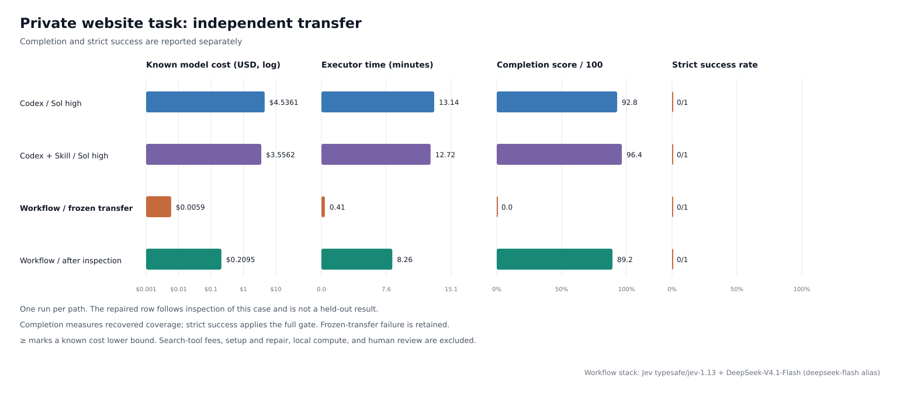

# Long-horizon website information processing: independent transfer

A second private case was independently selected after the workflow was frozen. All three paths received the same task goal. The executor had no access to reference answers, the earlier case outputs, or a prepared answer cache. Task identities, sources and raw artifacts remain local.

**The original frozen-transfer result is retained. The later repair is not a held-out result.**

| Path | Time | Known model cost | Completion / 100 | Field recall | Field precision | Strict acceptance |
| --- | ---: | ---: | ---: | ---: | ---: | --- |
| Codex / Sol high | 788.7s | $4.536140 | 92.8 | 88.0% | 100.0% | fail |
| Codex + original Skill / Sol high | 763.3s | $3.556231 | 96.4 | 94.0% | 100.0% | fail |
| Workflow / frozen transfer | 24.3s | $0.005935 | 0.0 | 0.0% | — | fail |
| Workflow / post-inspection repair | 495.6s | $0.209468 | 89.2 | 82.0% | 95.3% | fail |
| Workflow / earlier post-inspection repair | 330.8s | $0.159095 | 67.1 | 60.0% | 96.8% | fail |

## What the transfer test found

The frozen workflow stopped before delivering records because it incorrectly treated a missing optional source link as a prerequisite for the entire batch. The generic repair routes missing links to identity-checked retrieval and preserves explicit unknowns. Claims rejected by internal verification are removed from delivered fields and retained in the private audit trail; deterministic checks and Jev evidence verification still apply. A later repair also validates generated response envelopes and retries invalid structures within a bound, preserving factual values. No case-specific name, domain or expected value was added to these rules.

The repair is reported separately because the failure was already observed on this case. It cannot establish untouched transfer success. A low cost for an incomplete or failed result is not a successful-task saving.

## Measurement and models

The workflow uses **Jev (`typesafe/jev-1.13`) + DeepSeek-V4.1-Flash (`deepseek-flash` API alias)**. Jev handles typed verification; DeepSeek handles complex extraction and evidence recovery; code controls retrieval, bounded retries, validation and artifacts. Both Codex arms use independent Sol high subagents; the Skill arm uses the historical task Skill. Both received the same bounded continuation clarifying that explicitly qualified expected end dates are allowed. All continuation tokens and executor time are included; initial artifacts are retained locally.

Completion is 40% entity recall + 60% available-field recall. Strict acceptance additionally requires complete and precise membership, at least 95% field recall, 100% asserted-field precision, at least 95% evidence coverage, correct conflict handling, required-page resolution and saved artifacts. Missing available values count against recall.

Jev cost uses returned usage.cost. DeepSeek uses measured cache-hit/cache-miss/completion tokens at the [documented pricing snapshot](https://api-docs.deepseek.com/quick_start/pricing/) ($0.003/$0.15/$0.60 per million on the test date). Codex cost is an API-equivalent estimate from actual session tokens, not a subscription invoice. Reasoning tokens are included in completion. Search fees, setup/debugging, parent orchestration, grading and local compute are excluded; failed calls without usage remain unpriced.

## Limits and provenance

- One execution per path on this case; both baselines include one identical output-contract clarification continuation. No statistical success-rate claim.
- The frozen workflow was selected before the new case and used without modification.
- The original transfer failed and is retained; repair uses feedback from this case and is not held-out.
- No per-person expected answers or prior outputs were supplied to executors.
- Reference omissions and alternative primary sources are independently adjudicated, versioned and applied uniformly to every arm; executors do not receive them.
- Live web content, provider caches and tool availability are uncontrolled.
- Cost is execution-model spend, not total ownership cost.

Known provider spend across all retained workflow attempts on this case: **$0.374498**. Construction and debugging cost is excluded.

Frozen runner SHA-256: `cf9a0a50d0aa0597c627aa0af8bef580b6c7393c55759bcde8924f05ec9acda2`. Repair runner SHA-256: `beb155e48bcc1a714826d13cd53e6d85161542e0bac108fa7684da3d32d70b2a`.

[JSON](website-long-horizon-heldout.json) · [CSV](website-long-horizon-heldout.csv) · [Development-case report](website-long-horizon.md)
